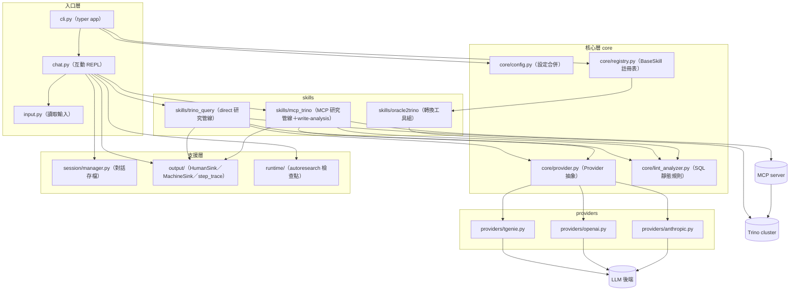

# 系統架構

## 目的與情境

GenieCLI 是以 LLM 輔助調校 Trino SQL 的命令列工具：整理 SQL 結構、EXPLAIN 計畫與執行證據後，請模型提出候選改寫，並以實測數據決定是否採納。使用者是資料工程師，在終端執行 `genie` 進入互動 REPL，或以檔案／stdin 一次性提問；主要產出為優化後的 SQL 與 markdown 研究報告（寫入 `report/` 目錄）。本文件描述模組分層與資料流，供修改功能時定位要動的 component。

## 圖

## 模組職責表

| 模組 | 職責 | 關鍵進入點 |
|---|---|---|
| `genie/cli.py` | typer app；解析全域旗標、路由到 chat／one-shot／sessions／config／tools／doctor／setup | `callback()`（genie/cli.py:173）、`main()`（genie/cli.py:447） |
| `genie/chat.py` | 互動 REPL：斜線命令分派（/trino-research、/trino、/autoresearch、session 管理） | `_chat_loop()`（genie/chat.py:422） |
| `genie/core/config.py` | 設定合併鏈：CLI 旗標 > 環境變數 > `~/.genie/config.toml` > `~/ai-agent-config.json` > 預設值 | `load()`（genie/core/config.py:39） |
| `genie/core/registry.py` | Skill 抽象與註冊表；`tier` 控制依模型能力載入 | `BaseSkill`（genie/core/registry.py:14） |
| `genie/core/provider.py` | LLM Provider 抽象（`CompletionRequest`／`Delta`／`ProviderCapabilities`） | `Provider`（genie/core/provider.py:31） |
| `genie/providers/*` | 三種 LLM 後端實作：內部 TGenie（multipart API）、OpenAI 相容（含 Ollama 原生偵測）、Anthropic | `_make_provider()`（genie/cli.py:62） |
| `genie/skills/trino_query` | `--direct` 研究管線：trino driver 直連、静態分析、stepwise 迭代 | `run_trino_research()`（genie/skills/trino_query/research.py:2251） |
| `genie/skills/mcp_trino` | MCP 研究管線、共用 preflight／診斷／write-analysis／等價驗證 | `run_trino_research_via_mcp()`（genie/skills/mcp_trino/research.py:3765） |
| `genie/skills/oracle2trino` | Oracle→Trino 轉換工具組（transpile／lookup／lint），註冊為 LLM tool | `register()`（genie/skills/oracle2trino/__init__.py:287） |
| `genie/session/manager.py` | 對話 JSON 存檔於 repo 根 `sessions/` | `save_session()`（genie/session/manager.py:48） |
| `genie/output/` | 終端輸出（HumanSink）與機器輸出（MachineSink）、步驟軌跡 step_trace | `HumanSink`（genie/output/human.py:42） |
| `genie/runtime/` | autoresearch 批次研究：檢查點、journal、run 管理 | `_run_autoresearch`（genie/runtime/autoresearch_cli.py） |

## 資料流敘事

**啟動流**：`main()` 啟動 typer app（genie/cli.py:447）；`callback()` 依 TTY 與 `--json` 選擇 MachineSink 或 HumanSink（genie/cli.py:193-194），載入設定（genie/cli.py:199）、以 `interface` 鍵選 provider（genie/cli.py:62-76）。有檔案引數或 stdin 非 TTY 時走 one-shot `_do_send`（genie/cli.py:229-252），否則進入 `_chat_loop`（genie/cli.py:256-258）。

**研究流（/trino-research）**：chat 解析旗標後三向分派——`--file` 且為寫入型 SQL → 離線 write-analysis（genie/chat.py:914-917）；`--direct` → trino driver 直連管線（genie/chat.py:919-924）；否則探測 MCP 可達性後走 MCP 管線（genie/chat.py:925-943）。兩條研究管線共用 mcp_trino 的 preflight／診斷／等價驗證元件（雙路徑鏡像），量測結果驅動迭代，最終報告寫入 `report/`（genie/skills/trino_query/research.py:2454-2462）。

**LLM 呼叫流**：管線組好 prompt 後以 `CompletionRequest` 呼叫 `provider.complete_text()`；TGenie 後端 401 時自動執行 `grab_auth.py` 刷新 token 後重試（genie/providers/tgenie.py:128-134）。

## 設計決策

- **雙路徑鏡像（direct／MCP）**：direct 路徑刻意鏡像 MCP 路徑的診斷與 preflight 元件（genie/skills/mcp_trino 下的共用模組被 trino_query 引用），docstring 明言「Mirrors `trino_query.research.run_trino_research`」（genie/skills/mcp_trino/research.py:3785-3788）。
- **路徑不偷換**：MCP 不可達時明確報錯並建議 `--direct`，不悄悄改用直連（genie/chat.py:934-940；README「三個安全重點」）。
- **playbook＋deterministic 分工**：LLM 只負責診斷與改寫建議；量測、等價驗證、報告生成皆為確定性程式碼，失敗的候選不會取代基準 SQL（genie/skills/trino_query/research.py:1653 起 seed gate、報告 fail-closed 見 genie/skills/trino_query/research.py:2122-2134）。
- **Provider 可抽換**：內部 TGenie 為預設 interface（genie/core/config.py:24），同一套管線可切 OpenAI 相容或 Anthropic（genie/cli.py:62-76），供內外環境共用。

## 實作細節

- 進入層合約（承接自 doc-layer 卡，已重驗）：`__main__.py` 只轉呼叫 `cli.main`（genie/__main__.py:1）；chat.py 不得 import cli.py（`build_prompt` 以 callable 注入避免循環依賴，genie/chat.py:10）；chat 的 tool 迴圈每輪上限 `MAX_TOOL_LOOPS = 15`（genie/chat.py:34），相同 `(tool_name, sorted_args)` 在最近 20 個動作出現 ≥5 次觸發 loop-detection（genie/chat.py:141）。
- 秘密不外洩：`genie config` 的機器輸出完全排除 `authToken`／`openaiApiKey`／`cookies`；人類輸出遮罩為前 4 後 4（genie/cli.py:280）。
- `setup_wizard._write_toml` 把新 key merge 進既有 `~/.genie/config.toml` 而非整檔覆寫，精靈沒碰的 key 得以保留（genie/setup_wizard.py:57）。
- `genie verify` 是 `genie doctor` 的向後相容別名，無獨立邏輯（genie/cli.py:441）。
- 版本字串 `5.0.0`（genie/cli.py:31）。
- 設定檔路徑：`~/.genie/config.toml`（新）、`~/ai-agent-config.json`（legacy）（genie/core/config.py:34-36）；MCP 另有 `~/.config/genie/mcp.json` 與 `[mcp.trino]` TOML 區段（genie/skills/mcp_trino/client.py:19-24）。
- 預設模型 `gemini-2.5-flash`（genie/core/config.py:29）。
- Trino 直連 profile 存於 `~/.config/genie/trino.json`（README；`genie setup trino` 建立）。
