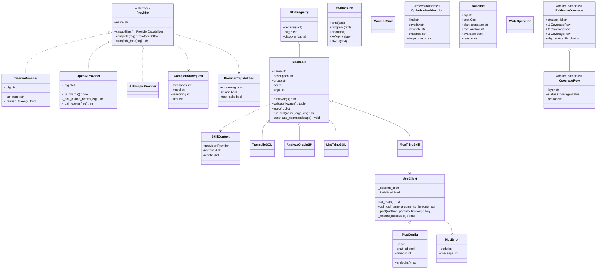

# 核心類別圖

## 目的與情境

GenieCLI 的可抽換點都以類別／dataclass 表達：LLM 後端（Provider）、工具（BaseSkill）、MCP 連線（McpClient）、輸出（Sink）。改後端、加工具、換輸出格式時，先看這張圖決定要實作哪個介面。瑣碎 utility 與函式式模組（research 管線本身是函式）不入圖。

## 圖

## 行為規則

1. Provider 三實作由 `_make_provider` 依 `cfg["interface"]` 選擇：`openai`→OpenAIProvider、`anthropic`→AnthropicProvider、其餘（含預設 `tgenie`）→TGenieProvider（genie/cli.py:62-76）。
2. TGenieProvider 收到 HTTP 401 時自動跑 `grab_auth.py` 刷新 token、reload config 後重試同一請求；刷新失敗才拋錯（genie/providers/tgenie.py:128-134）。
3. OpenAIProvider 偵測到 Ollama（base URL 含 `localhost:11434`／`127.0.0.1:11434`／`ollama`）且無附檔時改走原生 `/api/chat`（`think=false`、`num_ctx=8192`）——`/v1` 相容層不遵守 think=false（genie/providers/openai.py:59-68、82-91）。
4. `BaseSkill.tier` 控制載入時機：`core` 一律載入、`extended` 中階以上模型、`full` 只給頂級模型（genie/core/registry.py:17-26）。
5. `BaseSkill.run_tool` 先 `validate`（必填與 choices 檢查）再 `run`；TypeError 回報期望簽名、其他例外包成錯誤字串回傳，不讓工具例外炸掉對話（genie/core/registry.py:66-79）。
6. `OptimizationDirection`、`CoverageRow`、`EvidenceCoverage` 皆為 frozen dataclass——診斷方向與證據覆蓋一經建立不可變（genie/skills/mcp_trino/pre_execution_diagnosis.py:118-126、genie/skills/mcp_trino/strategy_verify.py:83-108）。
7. session 不是類別而是 dict 契約：`new_session` 產生 `{id, created_at, title, filename, history, redo_stack}`，訊息由 `new_msg` 統一為 `{id, role, content[{type,text,reasonText}], timestamp}`（genie/session/manager.py:17-45）。
8. SSE 解析（三 provider 共用）：`data: [DONE]` 與 `{"done": true}` 終止符都靜默跳過；content 累積為空時 fallback 到 reasoning tokens（genie/providers/base.py:13、24、47）。
9. AnthropicProvider 把 `system` role 從 messages 陣列抽出、提升為 payload 頂層 key（Anthropic API 格式要求）（genie/providers/anthropic.py:88）。
10. 三個 provider 的 capabilities 都宣告 `tool_calls=False`——tool 呼叫是 genieCLI 自己在回覆文字裡解析的，不用 API 原生 tool calling（genie/providers/anthropic.py:37）。
11. TGenieProvider 無條件 `verify=False` 停用 SSL 驗證，並於模組載入時全域抑制 InsecureRequestWarning——內部自簽環境的刻意取捨（genie/providers/tgenie.py:120、12）。
12. `_history_to_openai` 靜默丟棄 role 不在 user／assistant／system 的訊息（genie/providers/openai.py:30）。
13. MachineSink 契約：`result` 一律進 stdout、`error` 一律進 stderr、`progress` 是 no-op、`confirm` 恆回 True（非互動消費者永不阻塞）、`status` 是 nullcontext（genie/output/machine.py:17、25、13、31、57）。
14. HumanSink 共用單一 `Console(force_terminal=True)`；`status` spinner 由 daemon thread 每 0.5 秒更新經過秒數；表格 `box=None` 禁 ASCII 框線（genie/output/human.py:25、153、72）。
15. session 檔案存於 repo 根 `sessions/`（`SESSIONS_DIR` 以 `__file__` 相對推導，非 cwd 或 home）；`load_session` 會回填缺失的 `redo_stack`；`list_sessions` 只數 user role 訊息為 turns（genie/session/manager.py:10、60-61、76）。

## 設計決策

- **Provider 以 duck-typing 介面而非強制繼承**：三實作各自獨立，共同契約定義於 `genie/core/provider.py` 的 `Provider`（genie/core/provider.py:31）；`complete` 皆以單次 `_call` 包成單一 Delta（非逐 token streaming）（genie/providers/tgenie.py:43-45、genie/providers/openai.py:52-54）。
- **Skill 即 LLM tool**：`spec()` 直接輸出 tool schema（name/description/args），`contribute_commands` hook 允許 skill 追加 Typer 子命令（genie/core/registry.py:45-64、81-82）。

## 實作細節

- HumanSink／MachineSink 選擇邏輯：`--json` 或非 TTY → MachineSink，互動 REPL 強制 HumanSink（genie/cli.py:193-194、254-255）。
- `McpTrinoSkill` 將 MCP server 工具橋接為 skill（genie/skills/mcp_trino/__init__.py:27）。
