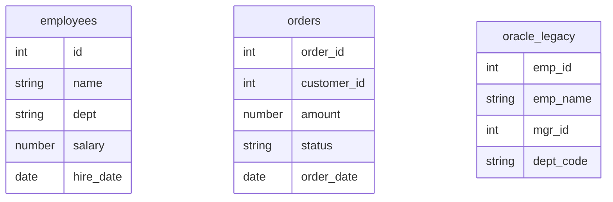

# DB Schema（e2e 測試環境）

## 目的與情境

GenieCLI 本身沒有應用程式資料庫；本文件描述的是 `infra/trino-stack` docker-compose 測試環境的種子資料表——e2e 與手動驗證時 `/trino-research`、oracle2trino linter 的操作對象。要重現測試環境時，先起 stack，再執行 `docker exec -it trino trino < infra/trino-stack/init/create-tables.sql`。

## 圖

## 欄位語意表

| 表.欄位 | 商業意義 |
|---|---|
| employees.dept | 部門代碼，同時是 Iceberg 分區鍵——設計來測分區過濾建議 |
| employees.salary | 薪資，提供聚合／排序類優化題材 |
| orders.customer_id | 下單客戶編號；環境中沒有 customers 表，是刻意留的懸空參照 |
| orders.status | 訂單狀態（completed／pending／cancelled），字串非 enum |
| orders.order_date | 訂單日期，Iceberg 分區鍵——測日期分區與 join 場景 |
| oracle_legacy.mgr_id | 主管的 emp_id，自我參照階層——測 Oracle 式 (+) join／CONNECT BY 殘留偵測 |
| oracle_legacy.dept_code | Oracle 風格部門代碼（D001…），與 employees.dept 語彙刻意不一致 |

## 行為規則

1. 兩張分區表的分區鍵：employees 以 `dept`、orders 以 `order_date`（`partitioning = ARRAY[...]`）（infra/trino-stack/init/create-tables.sql:12-22、37-47）。
2. 所有表建立於 `iceberg.warehouse` schema、PARQUET 格式；DDL 使用 `IF NOT EXISTS`，重跑 init 腳本不會失敗（infra/trino-stack/init/create-tables.sql:8-22）。
3. 無任何 PRIMARY KEY／FOREIGN KEY 約束（Iceberg connector 不支援）；參照完整性（如 orders.customer_id、oracle_legacy.mgr_id）僅存在於慣例（infra/trino-stack/init/create-tables.sql:12-64）。
4. 另有 `memory.test.numbers`（CTAS：VALUES 1..5）供快速臨時測試，屬 memory catalog、重啟即消失（infra/trino-stack/init/create-tables.sql:73-77）。
5. 腳本尾端以 UNION ALL 各表 COUNT(*) 自我驗證，種子列數：employees 10、orders 7、oracle_legacy 4、numbers 5（infra/trino-stack/init/create-tables.sql:24-34、49-56、66-70、80-85）。

## 實作細節

- Stack 定義：`infra/trino-stack/docker-compose.yml`；環境說明見 `infra/trino-stack/README.md`。
- oracle_legacy 的資料形狀（Boss→Manager→Worker 三層）刻意配合 linter 的階層查詢測試。
- erDiagram 只列 Iceberg 實體表；`memory.test.numbers` 為 CTAS 臨時表，記於行為規則不入圖。
