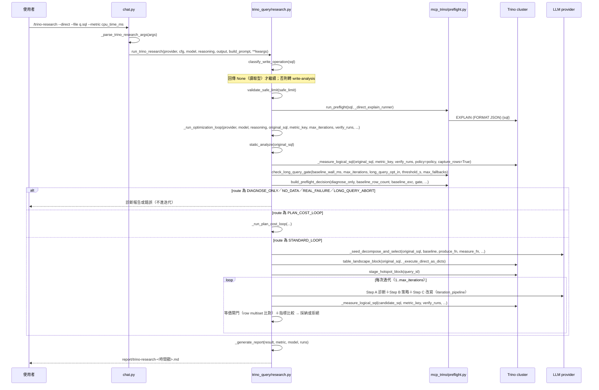
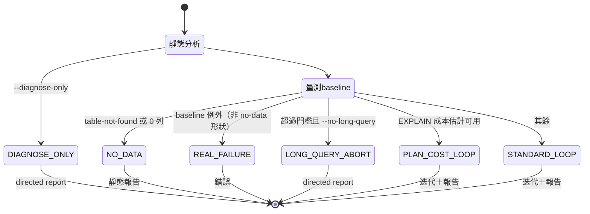

# /trino-research --direct（trino driver 直連研究管線）

## 目的與情境

使用者在 REPL 輸入 `/trino-research --direct --file q.sql --metric cpu_time_ms --iterations 5 --runs 3`，繞過 MCP、以 trino Python driver 直連叢集，對讀取型 SQL 做迭代優化。產出：終端摘要＋`report/trino-research-<時間戳>.md` 報告。觸發者：資料工程師（需先 `genie setup trino` 並安裝 trino 套件）。

## 圖

## 行為規則

1. 當 `--file` 的 SQL 被 `classify_write_operation` 判為寫入型時，系統會改走離線 write-analysis 並直接 return，不進優化迴圈（genie/skills/trino_query/research.py:2302-2309）。
2. 當未給 `--metric`／`--iterations`／`--runs` 時，系統會互動詢問，預設值分別為 `cpu_time_ms`、5、3（genie/skills/trino_query/research.py:2314-2346）。
3. 入口 preflight 一律以「原始 SQL」評估（非 safe-limit 包裝後的執行 SQL）；preflight 拒絕時整個 run 中止（genie/skills/trino_query/research.py:2366-2371）。
4. 當 baseline 例外呈 table-not-found 形狀或 baseline 回傳 0 列時，系統走 no-data 路徑產出靜態報告，不做迭代（genie/skills/trino_query/research.py:1320-1324、1429-1441）。
5. 當 baseline 牆鐘時間超過 long-query 門檻且使用者以 `--no-long-query` 拒絕長查詢時，系統產出 directed report 後停止，不再執行任何查詢（genie/skills/trino_query/research.py:1447-1465）。
6. 候選查詢的 timeout 上限取 baseline 牆鐘時間（`make_candidate_timeout_ms(baseline_wall_ms)`），避免壞候選拖垮整個 run（genie/skills/trino_query/research.py:1376-1384）。
7. EXPLAIN 證據每個不同 SQL 只跑一次並快取（directions、plan skeleton、repeated-subtree 共用），取代先前每個改善迭代最多三次 planner 往返（genie/skills/trino_query/research.py:1514-1534）。
8. 系統 prompt 強制候選「完全相同結果集、每迭代一個聚焦改動」，且 CTE 實體化只作建議、迴圈保持 read-only（genie/skills/trino_query/research.py:1583-1599）。
9. v48 seed decompose 預設開啟，`GENIE_V48_SEED_DECOMPOSE=0` 可關閉；fragment rewrite 為 opt-in（`GENIE_FRAGMENT_REWRITE=1`，上限 `GENIE_FRAGMENT_REWRITE_CAP` 預設 5）（genie/skills/trino_query/research.py:1606-1610）。
10. seed 勝者的 SQL 與量測值必須來自同一個 tuple arm（§3.1 NORMATIVE），被 seed gate 拒絕的記錄以 canonical failure record 寫入 history（genie/skills/trino_query/research.py:1649-1665）。
11. stepwise Step A/B/C 只在 `stepwise_enabled()` 且 provider 存在時啟用；其證據（QueryInfo 熱點、SHOW STATS 表況、repeated-subtree note）全部 fail-open——取不到就從 Step A prompt 省略（genie/skills/trino_query/research.py:1506-1508、1671-1711）。
12. baseline 的 QueryInfo 熱點必須在 run 結束後立刻抓取，因 coordinator 會將完成的查詢從記憶體歷史剔除（query.min-expire-age／query.max-history）（genie/skills/trino_query/research.py:1501-1512）。
13. 頂層無 ORDER BY 時，等價閘門比對 row multiset 而非位置順序（genie/skills/trino_query/research.py:1683-1685）。
14. 當 best_sql 偏離 original_sql 時，系統以零查詢成本（static＋EXPLAIN）重新診斷並快取（per-SQL），plan skeleton 一併更新（genie/skills/trino_query/research.py:1736-1760）。
15. 報告的等價聲明 fail-closed：history 中存在 `equivalence_unverified_incomplete_result` 時，報告不得聲稱 full row-level equivalence，改標 unverified 與拒絕原因（genie/skills/trino_query/research.py:2122-2134、2141-2154）。
16. 無任何改善時，報告仍輸出原始 SQL 並明言「No improvement kept」（genie/skills/trino_query/research.py:2220-2225）。
17. 靜態分析 `analyze` 永不拋例外：SQL 只 parse 一次跑全部規則，單一規則失敗被靜默跳過（debug log）；規則固定 10 條、順序 r1–r10（genie/skills/trino_query/sql_static/__init__.py:90、131、62）。
18. 直連執行層 `_try_execute` 永不拋例外（回傳含 error 欄位的 dict），且每次呼叫後關閉連線（genie/skills/trino_query/optimize.py:24、genie/skills/trino_query/research.py:125）。
19. `structural_equivalent` 只比對計畫簽章、不執行查詢——供零成本判斷兩個 SQL 的 optimizer 計畫是否同構（genie/skills/trino_query/plan_signature.py:138）。

### 路由決策狀態圖

（路由由 `build_preflight_decision` 產生，六個 route 的消費區塊見 genie/skills/trino_query/research.py:1404-1495。）

## 設計決策

- **Direct 路徑鏡像 MCP 路徑**：preflight、pre-execution 診斷、rule gate、seed decompose 皆 import 自 `mcp_trino` 共用模組（例如 genie/skills/trino_query/research.py:1328-1332、1552-1557、1625-1629），維持雙路徑行為對稱（設計標記「T-SYM」「dual-path parity」）。
- **失敗候選不取代基準**：接受條件由確定性程式碼裁決，非 LLM 自評（README「候選必須驗證」；seed gate 見 genie/skills/trino_query/research.py:1649-1662）。
- **報告含 provenance**：stepwise 啟用時報告記錄每迭代的 Step A 診斷與 Step B 策略、v48 step trace 附於報告尾（genie/skills/trino_query/research.py:2192-2199、2233-2242）。

## 實作細節

- 可選 metric：`cpu_time_ms`、`wall_time_ms`、`physical_input_bytes`、`processed_rows`、`total_splits`、`peak_memory_bytes`（genie/skills/trino_query/research.py:2277）。
- 記憶體相關環境變數（`GENIE_TRINO_MEMORY_LIMIT_PER_NODE_BYTES`、`GENIE_TRINO_MEMORY_PRESSURE_FRACTION`）對 `--direct` 路徑無效（genie/chat.py:337）。
- 報告輸出目錄：cwd 下 `report/`，檔名 `trino-research-<YYYYmmdd-HHMMSS>.md`；diagnose 與 no-data 各有前綴 `trino-research-diagnose-`／`trino-research-nodata-`（genie/skills/trino_query/research.py:2405-2427、2454-2462）。
