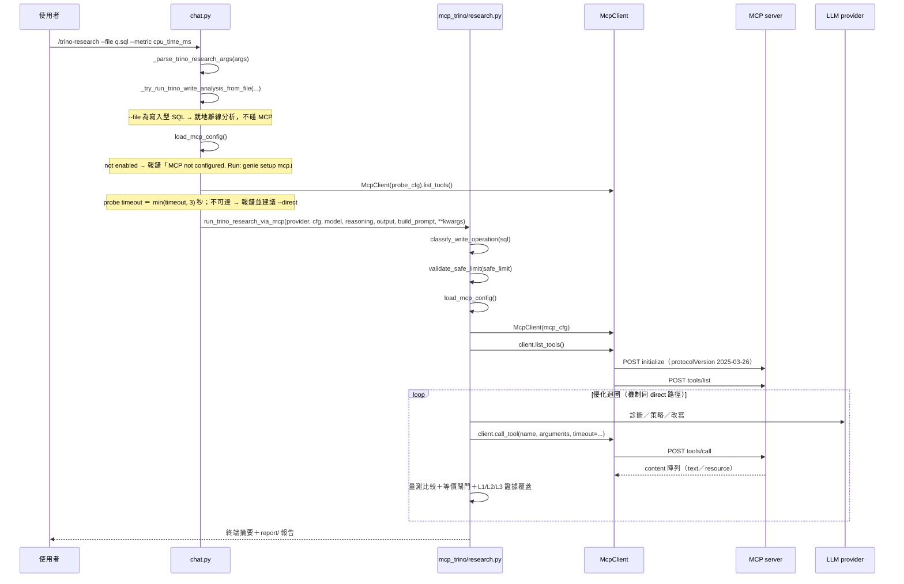

# /trino-research（MCP 研究管線，預設路徑）

## 目的與情境

REPL 內不帶 `--direct` 的 `/trino-research`（例：`/trino-research --file q.sql --metric cpu_time_ms --iterations 5 --runs 3`）。SQL 的執行全部經由 MCP server（Streamable HTTP、JSON-RPC 2.0）轉發到 Trino，適合不允許 CLI 直連叢集的環境。優化迴圈機制與 direct 路徑相同（本文件只寫 MCP 特有段），差異在：連線層走 McpClient、入口多一段可達性探測、且候選出貨附 L1/L2/L3 證據覆蓋。

## 圖

## 行為規則

1. `--file`／`sql_text` 提供的寫入型 SQL 在任何 MCP 設定與連線檢查之前就分類並轉離線 write-analysis，MCP 掛掉也能完成分析（genie/skills/mcp_trino/research.py:3794-3815）。
2. 讀取型 SQL 的 `--safe-limit` 在 MCP 設定載入之前驗證，無效值直接拒絕，不浪費連線與 provider 工作（genie/skills/mcp_trino/research.py:3817-3820）。
3. MCP 未啟用（config `enabled=false` 或無 url）時，chat 層直接報錯提示 `genie setup mcp`，不進入研究函式（genie/chat.py:926-930）。
4. chat 層可達性探測使用 `min(設定 timeout, 3)` 秒的短 timeout，失敗時明確報錯並建議 `--direct`，絕不悄悄 fallback（genie/chat.py:931-940）。
5. 研究工作負載會把 MCP timeout 拉高到 `max(設定值, query_timeout 或 RESEARCH_QUERY_TIMEOUT)`，避免長查詢被連線層切斷（genie/skills/mcp_trino/research.py:3827-3829）。
6. McpClient 首次請求前自動送 `initialize`（protocolVersion `2025-03-26`）與 `notifications/initialized`，並從回應 header 捕捉 `Mcp-Session-Id` 供後續請求（genie/skills/mcp_trino/client.py:190-209、153-156）。
7. 回應 Content-Type 為 `text/event-stream` 時走 SSE 解析抽出 JSON-RPC result；JSON-RPC error 一律拋 `McpError`（genie/skills/mcp_trino/client.py:158-170、172-188）。
8. `call_tool` 把 MCP content 陣列攤平為字串：text 取文字、resource 與其他型別 JSON 序列化（genie/skills/mcp_trino/client.py:229-249）。
9. MCP 設定解析優先序：環境變數（`GENIE_MCP_TRINO_URL`／`GENIE_MCP_TRINO_ENABLED`）> `~/.genie/config.toml` `[mcp.trino]` > `~/.config/genie/mcp.json` > 預設 `http://localhost:8811/mcp`（genie/skills/mcp_trino/client.py:39-90）。
10. 候選的證據覆蓋以 L1／L2／L3 三層記錄（`EvidenceCoverage`：每層 `CoverageRow(layer, status, reason)` 加總為 `ship_status`），資料結構凍結不可變（genie/skills/mcp_trino/strategy_verify.py:83-108）。
11. baseline 量測會計算計畫簽章（canonical 化後 sha256，剝除 row/byte 估計只留結構）與可選的 row_anchor（`SELECT count(*) FROM ({sql}) _anchor`），全程 never-raise（genie/skills/mcp_trino/trino_optimize.py:715-761）。
12. `check_read_only` 以白名單擋 DML/DDL：只有 SELECT／WITH／EXPLAIN／SHOW／DESCRIBE／DESC 開頭的語句可進執行路徑（genie/skills/mcp_trino/preflight.py:17）。
13. MCP skills 只在 `config.enabled` 為 True 時註冊——MCP 關閉時模型看不到這批工具（genie/skills/mcp_trino/__init__.py:117）。
14. rule_gate 刻意不改寫 SQL、只分類訊號（模組 docstring 明言）；`trino_optimize` 的公開函式與 `read_cost` 全部 never-raise，一律退化為帶型別的 unavailable／unverified 結果（genie/skills/mcp_trino/rule_gate.py:3、trino_optimize.py:7、cost_reader.py:43）。

## 設計決策

- **MCP 為預設、direct 為顯式逃生口**：REPL 幫助文字與分派順序皆以 MCP 為第一路徑（genie/chat.py:919-943），對應 README「啟用 MCP 時使用 MCP；MCP 不可達會明確失敗」。
- **與 direct 共用一套函式簽名**：`run_trino_research_via_mcp` docstring 明言鏡像 `trino_query.research.run_trino_research`，讓 chat.py 能以單一呼叫形狀分派（genie/skills/mcp_trino/research.py:3785-3788）。
- **每節點記憶體上限可由環境變數覆寫**：`GENIE_TRINO_MEMORY_LIMIT_PER_NODE_BYTES`（否則嘗試 SHOW SESSION，再 fallback 1 GiB）、壓力門檻 `GENIE_TRINO_MEMORY_PRESSURE_FRACTION` 預設 0.5——僅 MCP 路徑生效（genie/chat.py:328-337；門檻常數見 genie/skills/mcp_trino/pre_execution_diagnosis.py:43-44）。

## 實作細節

- MCP 路徑的 metric 清單比 direct 多一個 `query_time_ms`（MCP_METRICS 共 7 項，genie/skills/mcp_trino/research.py:3585-3589）；REPL 幫助文字的清單與兩條路徑皆不完全一致（genie/chat.py:301-302 列了 query_time_ms 但漏 peak_memory_bytes）。
- 傳輸層：requests.Session、header `Accept: application/json, text/event-stream`（genie/skills/mcp_trino/client.py:121-125）。
- clientInfo 回報 `genieCLI/5.0.0`（genie/skills/mcp_trino/client.py:196-200）。
- 預設 McpConfig：`url=http://localhost:8811/mcp`、`enabled=True`、`timeout=30`（genie/skills/mcp_trino/client.py:27-32）。
