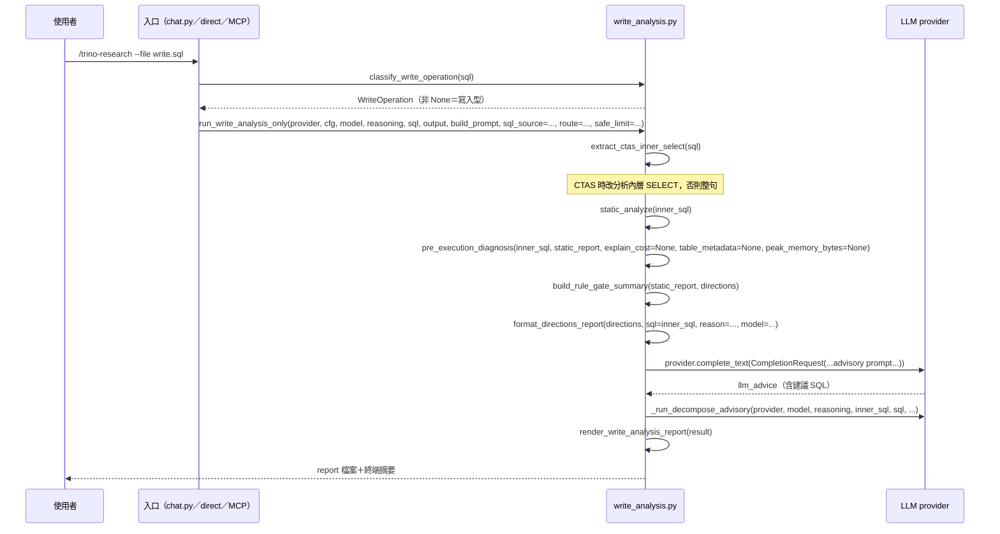

# 寫入型 SQL 離線分析（write-analysis）

## 目的與情境

`/trino-research --file write.sql` 的 SQL 含寫入或 DDL（INSERT／UPDATE／DELETE／CREATE／CTAS…）時，系統不執行、不 EXPLAIN、不 benchmark、不碰 MCP／Trino，只做離線 advisory 分析：靜態規則、零成本 directed 診斷、LLM 建議改寫與 decompose 建議，輸出報告供人工審閱。三個入口（chat 檔案分派、direct 路徑、MCP 路徑）共用同一函式，僅 `route` 標記不同。

## 圖

## 行為規則

1. 分類在原始 SQL 上進行；`classify_write_operation` 回傳 None（讀取型）時呼叫 `run_write_analysis_only` 會直接 `raise ValueError`——本流程只服務寫入型（genie/skills/mcp_trino/write_analysis.py:797-799）。
2. CTAS 語句剝掉 `CREATE TABLE ... AS` 外殼、只分析內層 SELECT；無法抽出時 fallback 整句（genie/skills/mcp_trino/write_analysis.py:801-806）。
3. directed 診斷與讀取型 `--diagnose-only` 共用同一條零成本管線，但所有叢集輸入（explain_cost／table_metadata／peak_memory_bytes）強制為 None，需要叢集的 contributor 自然退化為空；R1-R9 靜態與 SQL-shape 方向仍會產出並排序（genie/skills/mcp_trino/write_analysis.py:813-827）。
4. LLM advisory 為選配：provider 為 None 時跳過；呼叫失敗只記 `llm_error`，流程不中斷（genie/skills/mcp_trino/write_analysis.py:844-875）。
5. 互動模式下 advisory LLM 呼叫包在 spinner（`output.status(...)`）中執行，避免 Ctrl-D 後長時間看似凍結；MachineSink 上 status 為 no-op（genie/skills/mcp_trino/write_analysis.py:864-871）。
6. v40 decompose advisory（逐 fragment 拆解→優化→欄位閘門→重組）同樣非執行、只呼叫 `provider.complete_text`，作用對象與診斷相同（CTAS 內層或整句）（genie/skills/mcp_trino/write_analysis.py:877-882）。
7. 結果契約固定宣告 `executed: False`、`verified: False`、`advisory_only: True`、`live_dependencies_touched: False`——報告永不聲稱已驗證（genie/skills/mcp_trino/write_analysis.py:884-893）。
8. chat 檔案入口：讀檔失敗或空 SQL 直接報錯結束（回傳 True 表示已處理，不再往研究管線走）；SQL 為讀取型則回傳 False 交回一般分派（genie/chat.py:387-419）。

## 設計決策

- **寫入型一律離線**：對應 README 安全重點「寫入或 DDL 的 --file 輸入只做離線分析，不執行 SQL」；v35 已知邊界——互動 default MCP 貼上模式仍可能在取得貼上內容前先檢查 MCP 可達性（genie/chat.py:323-326 幫助文字明載）。
- **與讀取型共用診斷元件**：靜態規則與 directions 排序不重寫、只把叢集輸入設 None，維持單一真相來源（genie/skills/mcp_trino/write_analysis.py:813-818 註解）。

## 實作細節

- 報告先 render 一次、存檔取得路徑後把 `report_path` 塞回 result 再 render 一次寫入，確保報告內含自身路徑（genie/skills/mcp_trino/write_analysis.py:907-911）。
- result 記錄 `analysis_target`（`ctas_inner_select` 或 `whole_statement`）與 `analyzed_sql` 供報告區分（genie/skills/mcp_trino/write_analysis.py:897-898）。
