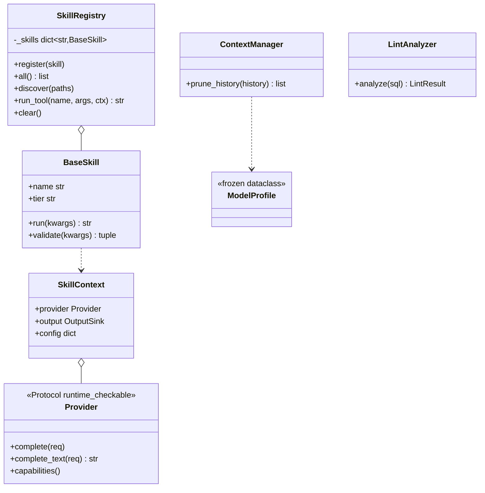

# 模組：genie/core（共用基礎層）

## 目的與情境

`genie/core` 是整個 CLI 的共用地基，五個關注點：LLM provider 抽象、skill 插件系統（BaseSkill／SkillRegistry／檔案系統探索）、context window 預算管理（ContextManager）、Trino SQL 靜態分析（lint 規則與工具）、設定載入（四層合併鏈）。所有 skill、CLI 命令、provider adapter 都依賴這裡的抽象，外部不得繞過。本文件承接原 doc-layer genie-core 卡的 invariants，已逐條對現行程式碼重驗。

## 圖

## 行為規則

1. `SkillRegistry` 是 class-level dict 單例；測試之間必須呼叫 `clear()`，否則狀態跨測試洩漏（genie/core/registry.py:88）。
2. `Provider` 是 `@runtime_checkable` Protocol 而非 ABC——實作者靠 duck-typing，不需繼承（genie/core/provider.py:30）。
3. 設定解析順序固定：CLI 旗標 > 環境變數（GENIE_*）> `~/.genie/config.toml` > `~/ai-agent-config.json` > DEFAULTS（genie/core/config.py:4、39-62）。
4. `ContextManager` 在歷史 token 達 context window 70% 時開始修剪（`_PRUNE_TRIGGER_RATIO = 0.70`）（genie/core/context_manager.py:18）。
5. 單一 tool result 在進一步處理前硬截 3000 字元（genie/core/context_manager.py:19）。
6. `prune_history` 永遠保留第一則（system）與最後 4 則訊息（genie/core/context_manager.py:71）。
7. `BaseSkill.tier` 必須是 `core`／`extended`／`full` 之一；`tier` 決定依模型能力載入的範圍（genie/core/registry.py:26）。
8. Oracle 殘留 lint 規則從共用 pattern catalog 解析；catalog 缺項時 `raise LookupError`，不會靜默通過（genie/core/lint_rules.py:44）。
9. skill 探索要求目錄同時存在 `__init__.py` 與（`SKILL.md` 或 `skill.toml`）；只有 `__init__.py` 的目錄被靜默跳過（genie/core/registry.py:190）。
10. `ModelProfile` 是 frozen dataclass——模型能力資料建立後不可變（genie/core/model_profiles.py:16）。

## 設計決策

- **五個關注點放同一 package 而非拆散**：它們共同構成「所有上層都要 import 的最小地基」，避免上層彼此互相 import（chat.py 不 import cli.py 的鐵律靠 build_prompt 注入維持，genie/chat.py:10 模組 docstring）。
- **lint 靜態分析放 core 而非 skills**：oracle2trino 與 trino_query 兩個 skill package 都要用（genie/skills/oracle2trino/__init__.py:282 引用 core.lint_analyzer）。

## 實作細節

- context_manager 相關常數集中於檔頭：修剪觸發比例、tool result 截斷長度（genie/core/context_manager.py:18-19）。
- 預設 interface `tgenie`、預設模型 `gemini-2.5-flash`（genie/core/config.py:24、29）。
