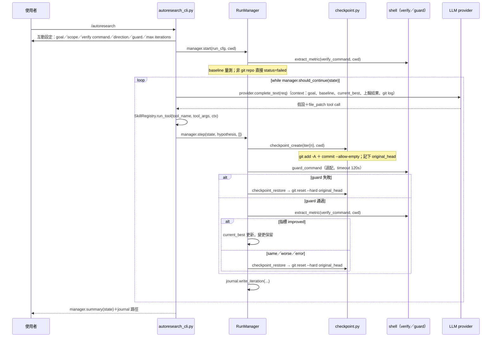

# 模組：genie/runtime（autoresearch 迭代引擎）

## 目的與情境

`/autoresearch` 的執行引擎：使用者給定目標、驗證命令與方向後，LLM 每迭代提出一個假設並 patch 檔案，RunManager 以 git checkpoint 保護每一步——guard 或指標未改善就 `reset --hard` 還原，全程寫入 TSV journal。與 `/trino-research` 的差別：autoresearch 改的是**檔案**（任何 repo、任何指標），trino-research 改的是**SQL**。

## 圖

## 行為規則

1. 互動設定的預設值：scope `**/*.py`、direction `higher`、max iterations 10；goal 與 verify command 為必填，缺少直接結束（genie/runtime/autoresearch_cli.py:56-77）。
2. cwd 不是 git repo 時 `RunManager.start` 立即回傳 `status="failed"`，不做任何量測（genie/runtime/run_manager.py:85）。
3. `checkpoint_create` 在現行分支上 `git add -A` ＋ `commit --allow-empty`，並在 commit 前記下 `original_head`（genie/runtime/checkpoint.py:68-93）。
4. `checkpoint_restore` 一律 `reset --hard` 回 **original_head**（checkpoint 前的狀態），不是 checkpoint commit 本身——還原等於整步作廢（genie/runtime/checkpoint.py:110）。
5. guard 失敗先還原再記錄結果；還原本身失敗則整個 run 標記 failed（genie/runtime/run_manager.py:180-225）。
6. verify command 非零退出一律 `success=False`，不管 stdout 內容（genie/runtime/metric.py:51）；metric 抽取先用 `metric_pattern` 的 capture group 1，否則取 stdout 最後一個浮點數，原始輸出截 2000 字元（genie/runtime/metric.py:49、63）。
7. 只有 `improved` 會推進 `current_best` 並保留變更；same／worse／error 都還原（genie/runtime/run_manager.py:245-249）。
8. `should_continue` 先看 status 非 `running` 即停，再檢查 `max_iterations`（genie/runtime/run_manager.py:297）。
9. `JournalWriter` 只在檔案不存在時寫 TSV header；每迭代 append 一列（genie/runtime/journal.py:27）。
10. LLM 未回 tool call 時提醒一次再重試；第二次仍無就跳過該迭代（不是中止 run）；patch 工具失敗也只是回饋給模型換方法（genie/runtime/autoresearch_cli.py:155-188）。
11. checkpoint label 中 `[a-zA-Z0-9_-]` 以外字元替換為底線，避免污染 git commit message（genie/runtime/checkpoint.py:35）。
12. Ctrl-C 中斷時 status 設為 `stopped`，仍輸出 summary 與 journal 路徑（genie/runtime/autoresearch_cli.py:212-218）。

## 設計決策

- **git 當還原機制而非自建 undo**：每步一個 checkpoint commit，失敗 `reset --hard`；代價是 autoresearch 只能在 git repo 內跑（規則 2）、且會在使用者分支留下 checkpoint commits（genie/runtime/checkpoint.py:2-8 模組 docstring）。
- **checkpoint／metric 函式回傳 dict 不拋例外**：錯誤處理結構化（`{"error": ...}`），迴圈層決定要不要停（genie/runtime/checkpoint.py:7-8）。
- **avoid circular import**：autoresearch_cli 接收 `build_prompt` callable，不 import cli.py（genie/runtime/autoresearch_cli.py:4-6）。

## 實作細節

- guard command 以 `shlex.split`＋`shell=False` 執行，timeout 120 秒（genie/runtime/run_manager.py:168-175）。
- system prompt 可由 `workflows/autoresearch.md`（WorkflowLoader）注入，失敗 fail-open 為空字串（genie/runtime/autoresearch_cli.py:88-93）。
- 每迭代餵給 LLM 的 context 含最近 5 條 git log（genie/runtime/autoresearch_cli.py:123-141）。
