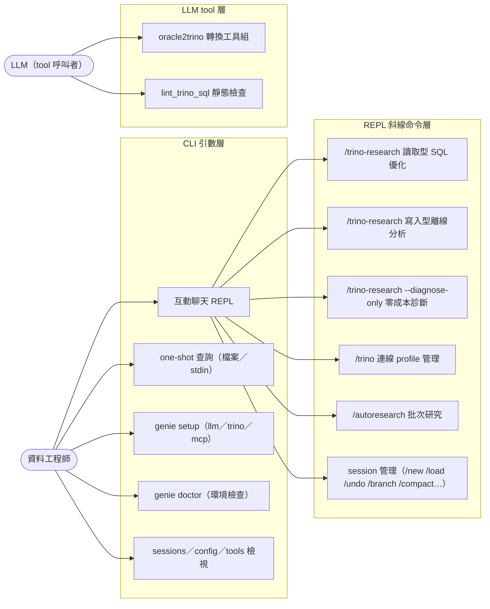

# Use Cases

## 目的與情境

GenieCLI 的功能入口分三類：CLI 引數層（`genie` 指令本身）、REPL 斜線命令層（互動聊天內），以及註冊給 LLM 的 tool 層（模型在對話中自主呼叫）。本文件列出每個入口的觸發方式與一句話行為，供快速回答「這個功能從哪裡進、做什麼」。

## 圖

## 各 Use Case 敘事

**互動聊天 REPL** — 執行 `genie`（無引數、TTY）進入 `_chat_loop`，顯示 banner、模型、skills 與 Trino 連線狀態（genie/cli.py:256-258、genie/chat.py:441-457）。

**one-shot 查詢** — `genie <檔案路徑>` 讀檔提問；或 stdin 非 TTY（管線輸入）時讀 stdin 一次性回答，兩者皆走 `_do_send` 不進 REPL（genie/cli.py:229-252）。

**genie setup** — `genie setup`（預設 llm）／`genie setup trino`／`genie setup mcp` 進入互動設定精靈，分別寫入 `~/.genie/config.toml`、`~/.config/genie/trino.json`、`~/.config/genie/mcp.json`（genie/cli.py:218-221；README「設定並檢查」）。

**genie doctor** — `genie doctor`（或 `genie verify`）檢查 Python、依賴、LLM、Trino 與 MCP 整合（genie/cli.py:215-217）。

**sessions／config／tools 檢視** — `genie sessions`、`genie config`、`genie tools` 分別列出既存對話、生效設定與已註冊 skills（genie/cli.py:206-214）。

**/trino-research 讀取型 SQL 優化** — REPL 內最核心的入口。讀取型 SQL 依 `--direct` 走 trino driver 直連或（預設）MCP 管線，迭代產生候選改寫並實測，報告寫入 `report/`。詳見 flows/trino-research-direct.md 與 flows/trino-research-mcp.md（genie/chat.py:908-943）。

**/trino-research 寫入型離線分析** — `--file` 內容判定為寫入型（INSERT／UPDATE／DDL 等）時，只做離線 advisory 分析，不執行任何 SQL。詳見 flows/write-analysis.md（genie/chat.py:914-917）。

**/trino-research --diagnose-only** — 零成本直達診斷報告：static 規則＋EXPLAIN 計畫，不執行查詢（genie/skills/trino_query/research.py:1416-1427）。

**/trino 連線 profile 管理** — `/trino`（列出）、`/trino use|add|remove <name>`、`/trino test`：多組 Trino 直連 profile 的切換與互動新增（genie/chat.py:770-836）。

**/autoresearch 批次研究** — 需啟用 skills；把研究流程交給 runtime 的檢查點式批次執行（genie/chat.py:947-955）。

**session 管理** — `/new`／`/sessions`／`/load`／`/history`／`/clear`／`/undo`／`/redo`／`/branch <n>`／`/compact [n]`；退出時有使用者訊息才存檔（genie/chat.py:468-727）。另有 `/reasoning`（循環切換推理等級，genie/chat.py:730-749）與 `/renew`（跑 `grab_auth.py` 刷新 TGenie token，genie/chat.py:752-767）。

**oracle2trino 轉換工具組（LLM tool）** — 六個工具註冊給模型自主呼叫：`transpile_sql`（sqlglot 機械轉換）、`lookup_oracle_function`、`lookup_oracle_type`、`list_trino_limitations`、`analyze_oracle_sp`（含 connector 差異註記）、`lint_trino_sql`（genie/skills/oracle2trino/__init__.py:287-293）。

**lint_trino_sql 靜態檢查（LLM tool）** — 偵測 Oracle 殘留（NVL／DECODE／ROWNUM／(+) join）、SELECT *、隱式 cross join、COUNT(DISTINCT) 等，回傳含 severity 與修法的結構化 findings（genie/skills/oracle2trino/__init__.py:262-284）。
