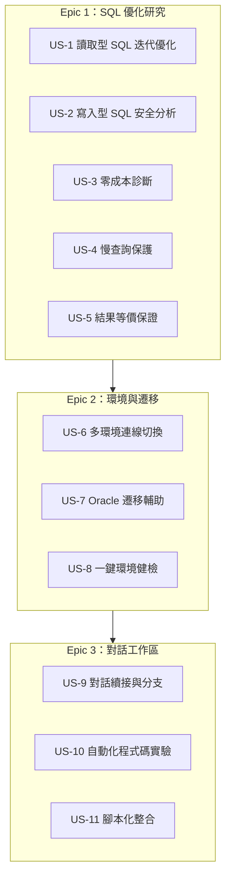

# User Stories（產品行為覆蓋）

## 目的與情境

以使用者故事表達 GenieCLI 的功能覆蓋範圍：每則故事一句「身為…我要…以便…」，附驗收要點（連到 flows／use-cases 的行為規則編號與程式碼證據）。看這份可以回答「產品現在做到了什麼、保證了什麼」；細節機制往連結的文件走。故事依三個 epic 分組，對應 use-cases.md 的三個入口層。

## 圖

## Stories

### Epic 1：SQL 優化研究

**US-1 讀取型 SQL 迭代優化** — 身為資料工程師，我要把慢的 SELECT 丟給 `/trino-research`，以便拿到實測驗證過的改寫與報告。
驗收：預設走 MCP、`--direct` 直連（flows/trino-research-mcp.md 規則 3-4）；每個候選以 median of N runs 實測、只有更好才保留（flows/trino-research-direct.md 規則 2）；報告存 `report/`（同文件實作細節）。

**US-2 寫入型 SQL 安全分析** — 身為資料工程師，我要丟 INSERT／CTAS 等寫入 SQL 也能拿建議，以便不冒任何執行風險。
驗收：自動分類為寫入型即轉離線分析，不執行、不 EXPLAIN、不碰叢集；報告固定標 `executed: False`、`advisory_only: True`（flows/write-analysis.md 規則 1、7）。

**US-3 零成本診斷** — 身為資料工程師，我要 `--diagnose-only` 只看診斷不跑查詢，以便在敏感時段也能分析。
驗收：static＋EXPLAIN 即出 directed report，無查詢執行（flows/trino-research-direct.md 規則行為與路由狀態圖 DIAGNOSE_ONLY）。

**US-4 慢查詢保護** — 身為平台管理者，我要工具不會反覆執行本來就很慢的查詢，以便叢集不被研究流量拖垮。
驗收：long-query gate（`--no-long-query` 時超門檻改出報告不迭代）；候選 timeout 上限＝baseline 牆鐘（flows/trino-research-direct.md 規則 5-6）。

**US-5 結果等價保證** — 身為資料工程師，我要優化後的 SQL 保證同結果，以便敢直接替換上線。
驗收：等價閘門比對 row multiset（無 ORDER BY 時）；證據不完整時報告 fail-closed 標 unverified 與原因，絕不誇稱（flows/trino-research-direct.md 規則 13、15）。

### Epic 2：環境與遷移

**US-6 多環境連線切換** — 身為要面對多套 Trino 的工程師，我要以 profile 管理連線並隨時切換，以便同一工具打到不同環境。
驗收：`/trino use|add|remove|test`，profile 存 `~/.config/genie/trino.json`（use-cases.md「/trino 連線 profile 管理」）。

**US-7 Oracle 遷移輔助** — 身為做 Oracle→Trino 遷移的工程師，我要在對話中請模型轉換與檢查 SP，以便半自動完成語法搬遷。
驗收：六個 oracle2trino 工具註冊給模型（transpile／lookup／limitations／SP 分析／lint）；轉換信心分數與 manual_fix_notes 結構化輸出（use-cases.md「oracle2trino 轉換工具組」）。

**US-8 一鍵環境健檢** — 身為新手使用者，我要 `genie doctor` 一次檢查所有整合，以便快速定位缺哪個設定。
驗收：檢查 Python／依賴／LLM／Trino／MCP；`genie verify` 為相容別名（use-cases.md「genie doctor」、architecture.md 實作細節）。

### Epic 3：對話工作區

**US-9 對話續接與分支** — 身為使用者，我要對話能存檔、載回、undo／redo、從第 n 輪分支、壓縮長度，以便長研究不怕走錯路。
驗收：`/sessions /load /undo /redo /branch /compact`；退出時有內容才存檔（use-cases.md「session 管理」）。

**US-10 自動化程式碼實驗** — 身為工程師，我要 `/autoresearch` 讓模型自主迭代改 code 並以指標裁決，以便掛機做優化實驗。
驗收：每迭代 git checkpoint、guard／指標未過自動 `reset --hard` 還原、TSV journal 全程記錄（modules/runtime.md 規則 3-7、9）。

**US-11 腳本化整合** — 身為要把 genie 接進 pipeline 的工程師，我要非 TTY／`--json` 時輸出機器可讀，以便下游程式解析。
驗收：非 TTY 或 `--json` 自動切 MachineSink（result→stdout、error→stderr、progress 靜默、confirm 不阻塞）（class-diagram.md 規則 13、實作細節）。

## 已知未覆蓋（誠實邊界）

- 互動貼上模式的寫入型 SQL 仍可能先探測 MCP 可達性（v35 已知邊界，flows/write-analysis.md 設計決策）。
- `--direct` 路徑不支援記憶體相關環境變數（flows/trino-research-direct.md 實作細節）。
- REPL 幫助文字的 metric 清單與兩路徑實際清單不一致（已記錄於 flows/trino-research-mcp.md 實作細節，待修）。
